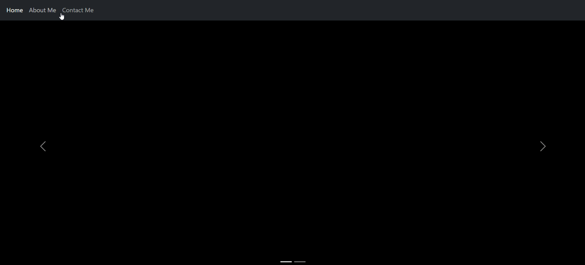

# Simple-Song-Request-Website-Using-Django

## Demo


## Overview

This is a simple django based website which takes song requests via a form. After storing it into a table, it retrives the three most recent requests and displays them on the screen.

## Steps To Run Locally

First, clone this repository to your local machine using:

```
git clone https://github.com/SibasishTripathyy/Simple-Song-Request-Website-Using-Django
```

Then install all the requirements using:

```
pip install -r requirements.txt
```

Apply all the migrations:

```
python manage.py migrate
```

Finally, run the server using the command:

```
python manage.py runserver
```

**Usually the server runs with "localhost:8000" port no. If not, then check the command prompt to find out the port no.**
